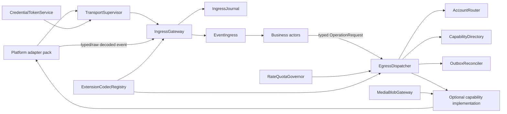

# OBCX 通用 Bot 能力组件建议

> 状态：**架构候选，未冻结 C++ API/ABI**。本页是父级根据九个平台证据与两轮审查确认的组件边界；证据详见[平台报告](agents/)与[能力分类审查](reviews/capability-taxonomy.md)。调研基线：2026-08-17。

## 1. 结论与计数

| 类别 | 数量 | 含义 |
|---|---:|---|
| 核心领域/数据模块 | **13** | 可序列化资源、事件、结果与约束，不执行网络操作 |
| 可选 Transport capability | **21** | 可独立发现、授权、版本化的操作或事件生命周期 |
| 运行时基础设施 | **12** | process-owned 的连接、路由、安全、可靠性与媒体设施 |
| 平台扩展包 | **10** | 九个平台扩展，加独立的 OneBot 11 兼容包 |
| **候选总数** | **56** | `13 + 21 + 12 + 10` |
| **Bridge MVP** | **26** | `10 core + 4 capability + 10 runtime + 2 pack` |

计数单位是职责内聚的模块/组件，不是每个 DTO、endpoint 或 actor message。该计数不意味着一次性实现全部 56 个组件。

## 2. 设计原则

1. DTO 与执行能力分离；`Message` 不携带 socket、token 或 adapter 指针。
2. 不再创建巨型 `IBot`。不支持的能力不提供空实现，而是在 capability discovery 中缺席。
3. 业务 actor 只收发可序列化的 typed request/result/event；连接、凭据、游标、重试和二进制流由进程设施持有。
4. 标准能力至少需要两个平台具备可对齐语义；否则进入 namespaced extension。
5. 接受、平台受理、送达、已读和未知结果是不同状态。
6. `InstallationRef` 明确选择平台、环境、租户与账号；禁止仅按 `platform` 猜测多账号路由。
7. 产品存在的功能不等于官方 API 能力。QQ 官方与 OneBot、Telegram Bot API 与 TDLib、个人微信与官方服务面严格隔离。

## 3. 依赖与数据流



```text
provider → process-owned adapter → verified/normalized ingress
         → IngressEvent<T> → business actor
         → OperationRequest<T> → BotEgressActor/EgressDispatcher
         → route + discovery + quota/outbox → small capability implementation
         → provider → OperationResult<T> / later DeliveryStateChanged
```

## 4. 保守的 `obcx::messaging` 资源模型

### 4.1 13 个核心领域模块

| ID | 模块 | 职责与依赖 | 代表性数据 | 证据平台与反例 |
|---|---|---|---|---|
| D01 | `ScopedIdentity` | 带 installation/namespace 的 human、bot、app、webhook 等主体标识；无依赖 | `PrincipalRef`、`NativeId` | QQ OpenID、微信 OpenID、Lark 多 ID、Matrix MXID；反例是无范围的 OneBot 数字 ID |
| D02 | `InstallationBinding` | 平台、region/environment、app/account、tenant 与无密钥 credential 引用；依赖 D01 | `InstallationRef` | X user context、WeCom/DingTalk tenant、Feishu/Lark 环境；Telegram 可无 tenant |
| D03 | `ConversationModel` | DM、group/room、broadcast、owned chat 与父子关系；依赖 D01–D02 | `ConversationRef`、`ConversationKind` | Discord/Matrix/Lark/Telegram；X List、微信 follower 集不是 conversation |
| D04 | `MessageReference` | 复合消息标识、reply/replacement 关系；依赖 D02–D03 | `MessageRef`、`ReplyRef` | 多数消息平台；反例是当前 Telegram `chat_id:message_id` 字符串拼接 |
| D05 | `PortableContent` | 最小文本、mention、link、媒体引用与简单展示 block；依赖 D01、D07 | `ContentBlock`、`Mention` | 多平台文本/媒体；卡片 JSON、Markdown 方言、任意 HTML 不进入核心 |
| D06 | `MessageSnapshot` | 作者、时间、内容可见性、关系、删除/替换状态和 provenance；依赖 D01、D03–D05、D07 | `MessageSnapshot` | Discord 内容脱敏、Matrix 原事件与 replacement；X post 不强制伪装成聊天消息 |
| D07 | `MediaReference` | 凭据范围、有效期、类型、大小、可选加密描述；依赖 D02 | `MediaHandle`、`BlobRef` | QQ/微信/WeCom/Lark/Matrix/Telegram 都有 scoped handle；URL 不视为永久资源 |
| D08 | `InteractionData` | action、typed values、deadline、ack/response 状态；依赖 D01–D06 | `InteractionRef`、`ActionValue` | Discord/QQ/Lark/DingTalk/Telegram/WeCom；稳定 Matrix、X 无通用 UI callback |
| D09 | `MembershipAuthorization` | conversation membership 与粗粒度观察权限，不宣称统一 RBAC；依赖 D01、D03 | `MembershipRef`、`PermissionSnapshot` | Discord/Matrix/Telegram/Lark/QQ Guild；X mute/block 不属于此模型 |
| D10 | `IngressEventModel` | 类型化事件 envelope、交付 ID/语义与 raw reference；依赖 D01–D09 | `IngressEvent<T>` | 九个平台的 callback/gateway/poll/sync；当前 OBCX envelope 可作为迁移基础 |
| D11 | `OperationModel` | typed request/result/error、分页、部分成功和未知结果；依赖 D01–D09 | `OperationRequest<T>`、`OperationResult<T>`、`Page<T>` | 多平台结构化错误/游标；替代当前 opaque JSON string |
| D12 | `DeliverySemantics` | 区分 submitted、accepted、delivered、read、failed、unknown；依赖 D04、D11 | `DeliveryState`、`DeliveryStateChanged` | 微信客服/WeCom 的受理不等于送达；Telegram 超时重试可能重复 |
| D13 | `CapabilityConstraints` | 可用操作、target kind、scope、权限、窗口、deadline、限额与探测时间；依赖 D02–D03、D09、D11 | `CapabilitySnapshot`、`OperationConstraint` | 所有报告均要求动态 discovery；替代 Telegram `{}` stub |

完整逐项证据与反例见[分类审查 §4.1](reviews/capability-taxonomy.md#41-core-domain-modules--13)。资源必须保存平台 provenance；没有跨平台稳定语义的字段通过版本化 extension 表示。

### 4.2 建议的 envelope（概念，不冻结语法）

```text
IngressEvent<T> {
  delivery_id?, provider_event_id?, installation,
  occurred_at?, received_at, delivery_semantics,
  payload: T, extension?, raw_ref?
}

OperationRequest<T> {
  operation_id, installation, capability, target?,
  idempotency_key?, deadline?, payload: T
}

OperationResult<T> =
  Completed<T> | Accepted | Partial | UnsupportedRace |
  ScopeOrGrantMissing | PermissionDenied | PolicyRejected |
  RateLimited | DeadlineExpired | NotFound | ValidationFailed |
  OutcomeUnknown | PlatformFailure
```

`UnsupportedRace` 只处理 discovery 后能力被撤销的竞态；正常不支持应表现为 capability 不存在。

## 5. 21 个可选 Transport capability

| ID | Capability | 生命周期/依赖 | 代表性 request/result/event | 采用平台（示例）与边界 |
|---|---|---|---|---|
| K01 | `EventIngress` | 订阅/过滤、验证、checkpoint、emit；D10/D13，R01/R02/R07 | `SubscribeEvents`、`SubscriptionState`、`IngressEvent<T>` | 所有有自动化面的平台；Gateway/callback/stream/poll/AS 仍是 transport metadata |
| K02 | `MessageSend` | 创建单条普通消息；D03–D07/D11–D13 | `SendMessage` → `Created<MessageRef>` | Discord、QQ、官方微信服务面、WeCom、Lark、DingTalk、Matrix、Telegram；X post/模板通知除外 |
| K03 | `MessageRead` | 获取单条或分页历史并声明 horizon；D04/D06/D11/D13 | `GetMessage`、`PageMessages` → `Page<MessageSnapshot>` | Discord/Lark/Matrix；Telegram Bot API、QQ C2C/group 无通用历史 |
| K04 | `MessageMutation` | edit/recall/redact/delete，返回精确语义；D04–D06/D11/D13 | `EditMessage`、`RemoveMessage`、`MessageRemoved` | Discord/X/Lark/Matrix/Telegram；Matrix redaction 非物理删除 |
| K05 | `ThreadLifecycle` | 创建/列出/更新/关闭 thread/topic；D03–D06/D11/D13 | `CreateThread`、`CloseThread`、`ThreadChanged` | Discord/Lark/Matrix/Telegram；X reply chain 不是可管理 topic |
| K06 | `ReactionLifecycle` | add/list/remove 与变更事件；D01/D04/D10–D13 | `AddReaction`、`RemoveReaction`、`ReactionChanged` | Discord/Lark/Matrix/Telegram；X like 属 SNS 扩展 |
| K07 | `PollLifecycle` | 创建/停止/读取原生 poll 与 answer 事件；D01/D04–D06/D10–D13 | `CreatePoll`、`StopPoll`、`PollAnswerChanged` | Discord、Telegram；Matrix poll 是 MSC，Lark vote 不等于 bot 可发送 |
| K08 | `PinLifecycle` | pin/list/unpin；D03–D04/D09/D11/D13 | `PinMessage`、`ListPins`、`UnpinMessage` | Discord/Lark/Matrix/Telegram；不推断到微信客服/X DM |
| K09 | `MediaTransfer` | upload/resolve/download/expire；D07/D11/D13，R11 | `UploadMedia` → `MediaHandle`、`DownloadMedia` → `BlobRef` | 主流消息平台；类型、TTL、大小动态约束 |
| K10 | `ConversationLifecycle` | 创建/读/改/删可管理 conversation；D03/D09/D11/D13 | `CreateConversation`、`UpdateConversation`、`DisbandConversation` | Discord/Lark/Matrix、WeCom appchat、Telegram 子集；普通 WeCom/微信群不可推断 |
| K11 | `MembershipLifecycle` | list/get/add/remove/join/leave；D01/D03/D09–D11/D13 | `GetMember`、`AddMember`、`RemoveMember`、`MembershipChanged` | Discord/Lark/Matrix/Telegram/QQ Guild；Telegram 不支持完整枚举 |
| K12 | `ConversationModeration` | restrict/kick/ban/timeout/approve；D03–D04/D09/D11/D13 | `RestrictMember`、`BanMember`、`ApproveJoinRequest` | Discord/Matrix/Telegram/QQ Guild；X block 是 social graph |
| K13 | `DirectoryRead` | 企业用户/部门层级与可见范围；D01–D02/D11/D13 | `GetDirectoryUser`、`ListDepartments` | Lark、DingTalk 已有一手证据；WeCom 为 `UNKNOWN pending official re-evidence`（S6 仅二手）；guild membership 不等于企业目录 |
| K14 | `InteractionResponse` | invocation ack/defer/follow-up；D08/D10–D13，R10 | `AcknowledgeInteraction`、`DeferInteraction`、`CompleteInteraction`、`InteractionInvoked` | Discord/QQ/Lark/DingTalk/Telegram/WeCom；Matrix/X 无稳定通用框架 |
| K15 | `InteractiveArtifact` | 可变交互卡片的发送/更新/退役；D05/D08/D11/D13 | `SendInteractiveArtifact`、`UpdateArtifact` | Lark、DingTalk 与 Discord 子集；WeCom mutable-card lifecycle 为 `UNKNOWN pending official re-evidence`（S15 仅二手），renderer schema/token 始终 namespaced |
| K16 | `CommandCatalog` | 发布/删除原生命令目录；D08/D10–D13 | `PublishCommands`、`RemoveCommands`、`CommandInvoked` | Discord、Telegram；文本命令解析不算原生 catalog |
| K17 | `TypingSignal` | 设置或观察短期 typing；D01/D03/D10–D13 | `SetTyping`、`TypingChanged` | Matrix/Discord 双向，QQ/Telegram 仅部分；与 presence/receipt 分离 |
| K18 | `Presence` | 设置/读取/观察 presence，携带可见范围；D01/D10–D13 | `SetPresence`、`PresenceChanged` | Matrix、Discord；Lark 等 omission-only 结论保持 UNKNOWN |
| K19 | `ReadReceipt` | mark/read-up-to 或观察明确已读；D01/D04/D10–D13 | `MarkRead`、`ReadReceiptChanged` | Matrix、Lark P2P 有一手证据；DingTalk send-status/read-status 仅由 S10 派生来源支持，默认禁用并保持 `UNKNOWN pending primary official verification`；delivery failure 不是 receipt |
| K20 | `FixedDestinationPublish` | 向预配置 secret-bound destination 发布；D05–D07/D11/D13，R06/R09 | `PublishFixedDestination` → `Accepted` | Discord/Lark/WeCom/DingTalk Webhook robot；不授予 ingress/history/member |
| K21 | `TriggerBoundReply` | 从 ingress 获取限时/限次回复授权并消费；D03–D06/D10–D13，R10 | `ReplyToTrigger` → `Accepted|DeadlineExpired` | 微信 OA/客服、WeCom IR/KF、QQ 被动回复、DingTalk session Webhook；不是 active send |

完整证据与反例见[分类审查 §4.2](reviews/capability-taxonomy.md#42-optional-executable-transport-capabilities--21)。

## 6. 12 个运行时基础设施组件

| ID | 组件 | 职责/依赖 | 内部消息示例 |
|---|---|---|---|
| R01 | `TransportSupervisor` | 持有 HTTP/WS/long-poll/Gateway/sync、启动停止与连接状态；依赖平台 pack | `StartInstallation`、`TransportStopped` |
| R02 | `IngressGateway` | 验签/解密/解码、durable admission、及时 ACK；依赖 R01/R07/R10/R12 | `RawIngress` → `IngressAccepted` |
| R03 | `EgressDispatcher` | 接收 typed actor request、解析实现并返回 correlated result；依赖 R04–R06/R08–R10 | `OperationRequest<T>` → `OperationResult<T>` |
| R04 | `CapabilityDirectory` | 按 installation/target 保存动态 snapshot，授权变化时失效 | `DiscoverCapabilities` → `CapabilitySnapshot` |
| R05 | `AccountRouter` | 显式解析 installation/account/target，拒绝歧义；依赖 D02–D03/R04 | `ResolveRoute` |
| R06 | `CredentialTokenService` | secret、token refresh、OAuth grant、Webhook secret 与脱敏 | `AcquireCredentialLease` |
| R07 | `IngressJournal` | delivery ID、cursor/update ID/sequence/transaction checkpoint 与去重 | `CommitIngress`、`AdvanceCursor` |
| R08 | `OutboxReconciler` | 保存出站意图、处理 outcome unknown、谨慎重试与 provider ID 对账 | `EnqueueOperation`、`Reconciled` |
| R09 | `RateQuotaGovernor` | 按 token/tenant/endpoint/target/recipient 动态限流 | `AcquireBudget`、`RateLimited` |
| R10 | `DeadlineTriggerCoordinator` | interaction ACK、被动回复、response URL 的 deadline/次数 | `RegisterTrigger`、`ConsumeTrigger`、`TriggerExpired` |
| R11 | `MediaBlobGateway` | 流式上传下载、临时 blob、安全扫描与 handle 映射；依赖 R06/R09 | `StoreBlob`、`ResolveMedia` |
| R12 | `ExtensionCodecRegistry` | 版本化校验、脱敏、解码 namespaced extension 与 raw reference | `DecodeExtension`、`UnknownVersion` |

这些组件是逻辑职责，不要求每个都成为独立进程或 shared library；部署合并不改变边界。

## 7. 最小 `IBotEndpoint` 与 adapter SPI（概念）

`IBotEndpoint` 仅存在于 process-owned runtime，用于一个 installation 的身份、状态和 capability 入口：

```text
IBotEndpoint (process-only)
  installation() -> InstallationRef
  endpoint_state() -> EndpointStateSnapshot
  capabilities(target?) -> CapabilitySnapshot
```

它**不**提供 `send_group_message()`、`get_friend_list()` 等平台动作，不返回给 actor，也不成为 actor service。生命周期由 `TransportSupervisor` 管理。

每个 adapter 组合小型实现，而非继承全量接口：

```text
IAdapterTransport          // connect/stop/health，process-only
IAdapterEventSource        // decoded event → IAdapterEventSink
IMessageSendCapability     // submit(SendMessage)
IMessageMutationCapability // submit(Edit/RemoveMessage)
IMediaTransferCapability   // upload/download
...                        // 只注册实际支持的 Kxx

IAdapterEventSink
  admit(AdapterIngressFrame) -> AdmissionResult
```

`AdapterIngressFrame` 可以在进程侧暂含协议对象，但进入 actor 前必须由 R02/R12 转成 D10 typed event 或版本化 `UnknownPlatformEvent`。凭据、连接句柄、文件流和 provider client 永不跨越该边界。

## 8. Actor ingress/egress 协议

### 8.1 通用入站事件

- `MessageCreated`、`MessageEdited`、`MessageRemoved{Recall|Redaction|DeleteNotice}`
- `ReactionChanged`、`ThreadChanged`、`ConversationChanged`
- `MembershipChanged`、`InteractionInvoked`
- `TypingChanged`、`PresenceChanged`、`ReadReceiptChanged`
- `DeliveryStateChanged`、`CapabilityChanged`
- `UnknownPlatformEvent{namespace,schema_version,raw_ref}`

Gateway heartbeat、resume sequence、Webhook CRC、OAuth callback 和 token refresh 默认是 runtime diagnostic，不进入业务事件流。

### 8.2 代表性出站消息

```text
DiscoverCapabilitiesRequested / CapabilitiesDiscovered
SendMessageRequested / MessageSendCompleted / MessageSendFailed
EditMessageRequested / MessageMutationCompleted / MessageMutationFailed
RemoveMessageRequested / MessageMutationCompleted / MessageMutationFailed
UploadMediaRequested / MediaUploadCompleted / MediaUploadFailed
ReplyToTriggerRequested / TriggerReplyCompleted / TriggerReplyFailed
```

每个 request 必须携带 `operation_id` 与明确 `installation`；result 用 envelope correlation/causation 返回。异步送达通过后续 `DeliveryStateChanged`，不把 HTTP 2xx 等同最终送达。

## 9. Capability discovery 与约束

`CapabilitySnapshot` 至少记录：

- capability ID 与 schema version；
- installation、surface 与可选 target kind；
- OAuth scope、intent、tenant-admin grant、role/right；
- send window、interaction deadline、history horizon；
- media/message size、pagination 与观察到的 rate scope；
- region/environment、API/spec version、探测时间与置信度；
- `available / temporarily_unavailable / lifecycle_risk / unknown_entitlement`。

QQ active send、X entitlement、Lark/Feishu parity、WeCom 二手证据能力不能硬编码为 true，必须保守关闭或运行时探测。

## 10. 10 个平台扩展包

| ID | Pack | 必须 namespaced 的语义 | 可复用 common capability |
|---|---|---|---|
| P01 | `discord.*` | guild/channel type、overwrites、intent/shard、Components V2、AutoMod、Voice/Stage | 按发现启用 K01–K21 子集 |
| P02 | `x.*` | post/edit chain、follow/mute/list/bookmark/timeline/search、Activity、legacy DM、XChat metadata、Spaces | 普通消息可用 K01–K04/K09；SNS 主要留扩展 |
| P03 | `qq.*` | 官方 C2C/group/Guild/Guild DM、opaque OpenID、intent、streaming、message audit、keyboard/Markdown grant | K01/K02/K04/K09/K11–K15/K17/K21 的已授权子集 |
| P04 | `wechat.*` | `official_account`、`mini_program`、`customer_service`、`open_platform`；follower/publication/template/menu/consent | K01/K02/K09/K21 的适用子集 |
| P05 | `wecom.*` | 一手证据覆盖 appchat、group robot、intelligent robot 与 archive transport；客服归 `wechat.customer_service` | 仅注册一手证据支持的 K01、K02、K09、K10、K11（仅 appchat）、K14、K20、K21；directory(K13)、recall(K04)、card update(K15)、customer-contact 细节及 internal-app send 细节均 `UNKNOWN pending official re-evidence` |
| P06 | `lark.*` | Feishu/Lark environment、chat mode、card、urgent、Calendar、Docs/Drive | 按 environment 与 operation 逐项 discovery；K17/K18 默认缺席/`UNKNOWN`，不声称广泛 K01–K20，也不从 Feishu 证据推断 Lark |
| P07 | `dingtalk.*` | app robot/group Webhook/session Webhook/Stream/advanced card/batch tracking/specialized robot | 仅复用一手证据支持的 K01、K02、K09、K13–K15、K20、K21；K04 recall 与 K19 send-status/read-status 仅为 S10-derived，默认禁用并保持 `UNKNOWN pending primary official verification` |
| P08 | `matrix.*` | room version/state key/power level/space/MXC/E2EE/appservice/identity/MSC | 版本/权限协商后的 K01–K19 子集 |
| P09 | `telegram.*` | topic/inline/Mini App/business/guest/managed bot/Stars/file ID/channel DM | Bot API 权限允许的 K01–K19 子集；TDLib 另部署 |
| P10 | `onebot11.*` | action/event/CQ segment、numeric ID、notice/request/meta、transport 与实现状态 | 仅映射被证明安全的 K01–K04/K09/K11–K12 |

完整 pack 证据见[分类审查 §4.4](reviews/capability-taxonomy.md#44-platform-extension-packs--10)。

### 10.1 Extension 与 raw 规则

- 命名：`<platform>.<surface>.<feature>`，例如 `qq.c2c_stream.update`、`matrix.room_state.v1`。
- payload 声明 `schema_version`；codec registry 可并存多版本，未知版本不得静默丢字段。
- 通用 DTO 保存 `extension` 和 `raw_ref`，但 raw 只指向经访问控制、脱敏、有限期的 runtime 存储；不把 token/cookie 放进 actor message。
- extension 不得改变 common 字段语义；无法无损映射时由策略显式选择拒绝或带 loss report 的降级。
- OneBot 11 raw/action 只证明兼容协议能力，不证明腾讯官方能力。

## 11. Bridge MVP：精确 26 个组件

| 类别 | 数量 | 精确集合 |
|---|---:|---|
| Core | **10** | D01、D02、D03、D04、D05、D06、D07、D10、D11、D13 |
| Capability | **4** | K01 `EventIngress`、K02 `MessageSend`、K04 `MessageMutation`、K09 `MediaTransfer` |
| Runtime | **10** | R01–R09、R11 |
| Pack | **2** | P09 `telegram.*`、P10 `onebot11.*` |
| **合计** | **26** | `10 + 4 + 10 + 2` |

MVP 数据流：

```text
P09/P10 adapter → K01 typed MessageCreated/MessageRemoved
→ actor/store → Bridge emits SendMessage/RemoveMessage request
→ R03 + R05 explicit account route + R04 discovery
→ K02/K04/K09 → typed result → persist provider message mapping
```

首期不实现 history fallback、好友/联系人、QQ honor/anonymous/cookie/CSRF、command/poll/reaction/card/payment、X SNS 或完整群管理。富内容降级必须由 Bridge policy 显式授权并记录损失。

## 12. 不进入通用层的能力

| 能力 | 原因 |
|---|---|
| X post/edit chain/follow/list/bookmark/timeline/Spaces | SNS 生命周期与聊天消息、membership 无可靠同构 |
| 微信模板/订阅通知与用户授权 | consent/template/window 语义独特 |
| 微信/WeCom 客服状态与 archive | 客服会话状态、合规拉取不是普通聊天历史 |
| Discord intents/shards/AutoMod/Voice Gateway | 授权与协议状态机平台专有 |
| QQ C2C streaming/message audit | replace-mode stream 与内容审核不是普通 edit/delivery |
| 平台卡片 renderer schema | 生命周期可归 K15，但 JSON schema、token 与更新规则不通用 |
| Matrix room state/power/appservice/E2EE/MSC | 协议状态机、安装权限与稳定性要求特殊 |
| Telegram inline/Mini App/business/Stars | UI、身份委托和商业语义专有 |
| 通用 voice/call/live/E2EE | Discord RTP、Matrix signaling、Telegram client call、X Spaces 没有可对齐 bot 生命周期 |
| 通用 audit | Discord audit log、QQ message audit、WeCom archive、Matrix event history 的目的与保证不同 |

## 13. 决策与证据边界

- **已确认架构决策**：13/21/12/10、56 总数、26 MVP、process-owned endpoint、typed actor 边界、10 个 pack。
- **仍需实现时验证**：所有 endpoint schema、C++ namespace/ABI、serialization、storage、retry policy、部署拓扑。
- **证据风险**：WeCom 多项仅有二手镜像；QQ active send 与 WebSocket 生命周期冲突；X entitlement 冲突；Feishu/Lark 无完整 parity；Matrix MSC/部署能力变化。它们均已体现在 discovery/UNKNOWN，而不是放宽 common contract。

参见：[能力矩阵](capability-matrix.md)、[OBCX 差距与迁移](obcx-gap-analysis.md)、[证据审计](reviews/evidence-audit.md)。
